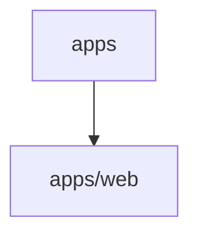

# 📚 AI-Phone-Agent-App Documentation

Welcome to the complete documentation for this repository. This documentation is automatically generated and maintained by Woden Docbot.

   

## 🔗 Quick Links

[📂 apps](./apps/README.md)
[📋 Dependencies](./DEPENDENCIES.md)

---

> Repository-level organization and test/configuration assets for a Next-based web application with React UI components and Jest testing setup.

## 📖 Overview

This repository organizes application-focused documentation, test configuration, and UI component sources for a web application. At the apps level it groups app-specific concerns and currently hosts a web/ subtree containing React UI components, storage-related tests, and a root-level Jest configuration tailored for a Next application.

Developers can find the web app's Jest setup (jest.config.js), grouped React component sources, and testing assets in apps/web. The layout keeps app-specific test setup and UI component code separate from core libraries and higher-level docs, making it easier to discover, build, and test the web application.

### 🧩 Key Components

| Component | Purpose | Technologies |
| --- | --- | --- |
| **apps** | Top-level grouping that collects application-level documentation, test configuration, and test artifacts. It organizes subdirectories so app-specific build/test/documentation assets are separated from core libraries. | `Jest`, `React`, `Next` |
| **apps/web** | Houses the web application's Jest test configuration and setup, grouped React UI component sources, and storage-related tests used by the web app. Includes a root-level jest.config.js tailored for a Next application. | `Jest`, `React`, `Next` |

**Component Architecture:**

### 🏗️ Architecture

Repository-level app grouping that separates app-specific test/config and UI component sources from other repo concerns. The web app is structured as a Next-targeted React application with Jest for testing and a dedicated jest.config.js for Next compatibility.

### 💡 Use Cases

- ✦ Discover and modify Jest test configuration for the web application (Next-targeted)
- ✦ Develop and test React UI components organized under the web app
- ✦ Maintain and run storage-related tests and grouped testing assets for the web application

### 🔧 Technologies

**Frameworks:** 
 

---

## 📑 Documentation Sections

### [apps](./apps/README.md)
Top-level directory that groups application-focused documentation and test/configuration artifacts for the project's apps, with a focus on the web application.

The docs/apps directory serves as the collection point for application-level documentation and related test/configuration assets.

---

## 📊 Documentation Statistics

- **Files Documented**: 8
- **Directories**: 7
- **Coverage**: 100%
- **Last Updated**: 2026-07-24

---

## 🧭 How to Navigate

> ℹ️ **INFO**
> Each directory has its own README.md with detailed information about that section. Use the breadcrumb navigation at the top of each page to navigate back to parent directories.

### Navigation Features

- **Breadcrumbs** - At the top of each page, showing your current location
- **Directory READMEs** - Each folder has a comprehensive overview
- **File Documentation** - Click through to individual file documentation
- **Search** - Use GitHub's search or your IDE's search functionality

---

## 🤖 About Woden DocBot

This documentation is automatically generated and kept up-to-date by Woden DocBot, an AI-powered documentation assistant. DocBot analyzes code on every pull request and updates documentation to reflect changes.

### Features

- **Automatic Updates** - Documentation updates on every PR
- **Comprehensive Coverage** - Files, functions, classes, and directories
- **Smart Navigation** - Breadcrumbs, related files, and parent links
- **AI-Powered** - Uses Azure GPT models for intelligent documentation generation

---

*Generated by Woden DocBot for AI-Phone-Agent-App*