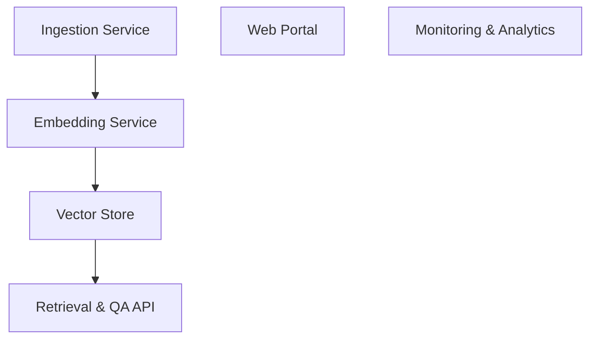

# 📚 AI-Phone-Agent-App Documentation

Welcome to the complete documentation for this repository. This documentation is automatically generated and maintained by Woden Docbot.

   

## 🔗 Quick Links

[📂 apps](./apps/README.md)
[📋 Dependencies](./DEPENDENCIES.md)

---

> DocBot is an AI-powered documentation assistant that ingests, indexes, and answers questions over project documents to make knowledge discovery fast, accurate, and accessible to developers and non-technical stakeholders.

## 📖 Overview

DocBot centralizes unstructured project knowledge into a searchable, conversational interface. It ingests documents from repositories, cloud storage, and support systems, creates semantic embeddings, and stores them in a vector index so users can ask natural language questions and receive concise, context-aware answers with source attributions.

The system is designed to be extensible and secure: ingestion pipelines normalize and metadata-tag documents, the embedding and retrieval layers are pluggable (allowing different models or vector stores), and a lightweight API and web portal provide role-based access, feedback collection, and analytics to continually improve relevance.

### 🧩 Key Components

| Component | Purpose | Technologies |
| --- | --- | --- |
| **Ingestion Service** | Crawls repositories and storage, normalizes documents, extracts metadata, and schedules processing for new or changed content. | `Python`, `Azure Functions`, `GitHub API` |
| **Embedding Service** | Converts document chunks into vector embeddings using configurable language models and handles batching and caching of embeddings. | `Python`, `OpenAI embeddings`, `LangChain` |
| **Vector Store** | Persists vector embeddings and supports approximate nearest neighbor searches for semantic retrieval. | `Redis (Vector Similarity)`, `FAISS`, `Azure Cosmos DB` |
| **Retrieval & QA API** | Accepts user queries, performs retrieval-augmented generation, composes answers with citations, and enforces access controls and rate limits. | `FastAPI`, `OpenAI / LLMs`, `JWT authentication` |
| **Web Portal** | User-facing interface for searching, conversational Q&A, feedback submission, and administration (dataset management, ingestion config). | `React`, `TypeScript`, `Tailwind CSS` |
| **Monitoring & Analytics** | Collects usage metrics, search relevance signals, and error logs to support observability and iterative improvement of the retrieval pipeline. | `Prometheus`, `Grafana`, `Azure Application Insights` |

**Component Architecture:**

### 🏗️ Architecture

DocBot uses a serverless ingestion pipeline feeding a modular embedding service and a scalable vector store. A retrieval API combines nearest-neighbor search with LLM-based answer generation, and a web portal plus analytics provide user access and operational visibility.

### 💡 Use Cases

- ✦ Answering developer questions about code, architecture, and setup from repo docs and READMEs
- ✦ Onboarding new team members by summarizing key documents and creating guided Q&A
- ✦ Customer support assistants that reference product docs and knowledge bases
- ✦ Automated compliance checks and discovery by searching policy documents

### 🔧 Technologies

**Languages:** 

**Frameworks:**  

**Cloud:**  

**Databases:** 

### 📦 External Dependencies

The following external packages are used across the project:

- `Azure Blob Storage`
- `GitHub API`
- `Grafana`
- `OpenAI API`
- `Prometheus`
- `Redis Enterprise / Managed Redis`

---

## 📑 Documentation Sections

### [apps](./apps/README.md)
Top-level container for application-level documentation and grouping of adaptive-tools API surface code and related app subcomponents.

The apps directory is a top-level grouping that contains application-focused code and subdirectories related to the adaptive-tools API surface.

---

## 📊 Documentation Statistics

- **Files Documented**: 4
- **Directories**: 6
- **Coverage**: 100%
- **Last Updated**: 2026-07-25

---

## 🧭 How to Navigate

> ℹ️ **INFO**
> Each directory has its own README.md with detailed information about that section. Use the breadcrumb navigation at the top of each page to navigate back to parent directories.

### Navigation Features

- **Breadcrumbs** - At the top of each page, showing your current location
- **Directory READMEs** - Each folder has a comprehensive overview
- **File Documentation** - Click through to individual file documentation
- **Search** - Use GitHub's search or your IDE's search functionality

---

## 🤖 About Woden DocBot

This documentation is automatically generated and kept up-to-date by Woden DocBot, an AI-powered documentation assistant. DocBot analyzes code on every pull request and updates documentation to reflect changes.

### Features

- **Automatic Updates** - Documentation updates on every PR
- **Comprehensive Coverage** - Files, functions, classes, and directories
- **Smart Navigation** - Breadcrumbs, related files, and parent links
- **AI-Powered** - Uses Azure GPT models for intelligent documentation generation

---

*Generated by Woden DocBot for AI-Phone-Agent-App*